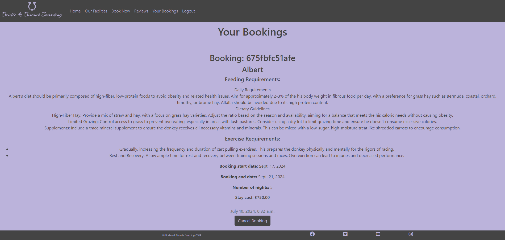

# Bridles & Biscuits Boarding

Bridle & Biscuit Boarding is a booking system for a short stay stables designed for people travelling without their equine companions. This  project is a Full Stack website built using Django. This stable booking website is built to allow users to book a stable online and leave reviews of their experience using our services. Users are required to register in order to book or leave a review. 

### Live Project Link
Deployed version: https://bridlesandbiscuits-c1f6a0cee3d5.herokuapp.com/ 

### MVP

The MVP for this project includes user registration, booking creation, and deletion to provide users with a easy to use booking system to book their mounts into Bridles and Biscuits Boarding. It also includes a review form with review creation, editing and deletion, so customers can leave reviews for future customers, to enable people to make an informed decision.

### Problem Statement

Problem statement: Owning your own horse or donkey is great but when you want to go on holiday, where can you get someone to take care of your horse. Many stables only do long term boarding and can you really trust someone coming in to check on them once or twice a day?

Purpose: Our site allows you to book your horse or donkey into a professionally run stables with highly qualified equine professionals for short stays, so that you can holiday in peace knowing your mount is fully cared for, supervised and safe.

Target audience: Horse or Donkey owners who normally keep their Horses and Donkeys in their own stable yards, when they want to or need to travel and are unable to take their Horses or Donkeys with them.

# Agile Development
I planned and tracked progress on this project using Agile methodology. I created a kanban board with GitHub Projects to manage the workload. 
After setting up the user stories as issues for my project I broke them down into smaller tasks with check boxes within each user story, to help me monitor my progress and finish all tasks on time.

To see the Kanban for the Bridles & Biscuits  Boarding project please click here: https://github.com/users/Charlie-Lambino-Worthington/projects/4

## User stories / Use Cases

User story:

As a user I want a welcoming homepage which tells me a bit about Bridles and Biscuits Boarding, its owners, it’s location and its ethos.

Use case:

User can get a basic overview of Bridles and Biscuits Boarding as a business. Leaving a good first impression.

Acceptance criteria

·         Logo

·         Welcoming colour scheme

·         Neat and elegant

·         Information about the owners

·         Information about the stables and its ethos

·         Images of owner and happy horses at Bridles and biscuits boarding

·         Location, and map

·         Links to social media

Tasks

o   Design logo

o   Decide on colour scheme and implement

o   Create html page for home with neat layout and elegant font

o   Information section about the stables and it’s ethos with image of happy horses there

o   Information section about the owners with images of owner looking friendly

o   Address and map so stables are easy to find

o   Footer with social media links

User Story:

As a user I want a facilities page which tells what Bridles and Biscuits Boarding offers.

Use Case:

Gives user an idea of the facilities available for their horses and donkeys and provide prices for a stable per night. Allowing them to make an informed decision based on the available facilities.

Acceptance criteria

·         Sand school

·         Cross country route

·         Walker

·         stable block

·         45 achers of grazing land with shelters and auto refilling water troughs

·         Homemade horse “biscuits” 

 

Tasks

o   Separate sections for each of the above features describing them and showing pictures of them in use

User Story:

As a user I want a booking form so that I can book a stay for my horse or donkey at bridles and biscuits boarding.

Use Case:

Allows users to input all required information into the bookings form so that the stable staff can look after the horses and donkeys according to their specified needs and give owners peace of mind.

Acceptance criteria

·         Only fillable when logged in

·         Input for horse/ donkey name

·         Input for feeding requirements

·         Input for exercise requirements

·         Input for start date

·         Input for end date

·         Creates a unique booking ID

·         Sends an email confirmation with cost, booking id and booking details

Tasks

o   Only fillable when logged in

o   Input for horse/ donkey name

o   Input for feeding requirements

o   Input for exercise requirements

o   Input for start date

o   Input for end date

o   Creates a unique booking ID

o   Sends an email confirmation with cost, booking id and booking details

o   Calculates cost of booking based on stable price per night and stay duration

User Story:

As a user I want a page to see my booking details so I can check them on the website.

Use Case:

Provides users with the ability to check their booking details and delete/cancel bookings as required.

Acceptance criteria

·         Displays all bookings from logged in user

·         Displayed in order of recency

Tasks

o   Only displays bookings from the logged in user

o   Displays in order of recency

o   Displays all booking details

User Story:

As a user I want a log in/out and register function so that only I can access my details.

Use Case:

Restricts access to private information and booking details and ensures the user is logged in when booking and reviewing so that their booking details are linked to their account for ease of access when checking booking details.

Acceptance criteria

·         Forms only fillable when logged in

·         Booking details only viewable when logged in

·         Reviewing only possible when logged in

·         Log in/out and register page matches formatting and styling of the rest of the site.

Tasks

o   Log in and log out and register using allauth

o   Email confirmation required

o   Styling matches the rest of the site

o   Reviews viewable without login

o   Leaving reviews, booking and viewing bookings only when logged in.

User Story:

As a user I want a reviews page so that I can make an informed decision based on other people’s experiences at Bridles and Biscuits Boarding

Use Case:

Allows customers to make an informed decision and leave reviews for future customers.

Acceptance criteria

·         View star ratings and comments left by previous customers when not logged in

·         Ability to leave a star rating and review when logged in

·         Only able to leave a review with a valid booking id so users know all reviews are from real previous customers

·         Booking IDs not displayed with the reviews

Tasks

o   View star ratings and comments left by previous customers when not logged in

o   Ability to leave a star rating and review when logged in

o   Only able to leave a review with a valid booking id so users know all reviews are from real previous customers

o   Booking IDs not displayed with the reviews

## Database Diagram
Bridle & Biscuit Boarding's database is composed of several distinct tables, each serving a specific purpose. The tables are comprised of Users, Book, Stable_availability, Stables, Review. Together, they allow potential customers to easily complete CRUD functionality (Create, Read, Update, Delete) through an intuitive web-based user interface.

The User table is key to the interconnectivity of the backend of the application. It connects other tables through foreign key relationships,allowing for the functionality and cohesion of the system. Within the database, the book model and Reviews model  are linked to users through  Foreign Key relationships, allowing users access to view and delete bookings as well as create, edit, and delete reviews associated with their account.

## Data Models:

| Book   |            |   |
|----------|:-------------:|------:|
| Horse name |  CharField |  |
| Feeding requirements |  CharField   |   FK |
| Exercise requirements | CharField |     |
| Stay start date |  DateField |   |
| Stay end date |  DateField |   |
| Number of nights |  IntegerField |   |
| Bokked on |  DateField |   |
| User |  CharField | FK |
| Booking ID |  SlugField   |   FK |
| Email | EmailField | FK |
| Stable ID |  Foreign Key | FK  |

| Review  |            |   |
|----------|:-------------:|------:|
| title |  CharField |  |
| user |  ForeignKey | FK |
| rating |  IntegerField |  |
| comment |  TextField |  |
| featured image |  CloudinaryField |  |
| created on |  DateField |  |
| Booking ID |  ForeignKey | FK |

| Stables  |            |   |
|----------|:-------------:|------:|
| stable number |  IntegerField | FK  |
| status |  IntegerField |  |
| Cost per night |  IntegerField |   |

| Stable availability  |            |   |
|----------|:-------------:|------:|
| Stable |  IntegerField | FK  |
| Start date |  DateField |   |
| End date |  DateField |   |

## User Flow Chart

User flow charts are crucial for web app planning as they facilitate a user-centered design approach, helping to eliminate friction in user journeys and reduce churn by streamlining the user experience. This chart was planned out enable early iteration and refinement of the design for the Bridles and biscuits boarding site, based on a clear visualization of the user's path to achieving their goals within the web app.

# UX Design

## Design Choices

For this colour scheme the hope was to create a bright and cheerful yet reserved and elegant with the majority of the page design having the light purple #bbb3db with the slate grey #444444 for the text, however this is inversed in the logo, buttons, nav bar and footer. Using the same colours to create a uniform feeling while also making these elements stand out. The pink #c26dda was just used to pull in a pop of subtle colour to attract the eye when hovering over certain links.

## Wireframes
Home Page

Facilities Page

Book Now Page

Your Bookings Page

Reviews Page

Edit Reviews Page

Log In Page

Log Out Page

Register Page

# Features

## home page

The landing page provides an introduction to the website with a section introducing the stables and a section introducing the owner of the stables. 

 Displaying an image for each section using asthetically pleasing images of the feilds at the stables and of the owner, to give a good first impression of the stables.

The navigation bar is great for users as it provides efficint access to all the important pages of the website. The navigation bar includes links to Home, Our Facilities, Book Now, Reviews, Your Bookings and Log In.

The footer contains useful information for users including the copywrite information and links to Facebook, Twitter, Youtube and Instagram.

## Facilities page

The facilities page is a great source of information for potential customers as it has sections about the stable blocks, the grazing land, the on site vet and farrier, the homemade horse biscuits and the State Of The Art, the  Exercise Facilities including the Sovereign Plus Horse Walker, the Olympic size Sandschool and the Cross-country Routes. Including images of each of these facilities so that customers know what to expect.

## Registration

Registration allows users to view their bookings, make bookings, leave reviews and edit any reviews they had made previously.

## Log in

## Log out

## Book now

Our booking form allows customers to enter details including 
 
o Input for horse/ donkey name

o   Input for feeding requirements

o   Input for exercise requirements

o   Input for start date

o   Input for end date for their booking 

o   Input for number of nights

o   Input for email address

This enables the user to easily make a booking through the UI.

Some booking validation criteria was applied to the form to check that there are no overlapping booking for the same stable at the same time. If the all the stables are booked at a given date the form alerts the user that booking is not available on the given date.

The form also validates the data input and alerts users if there are issues so that they can correct any issues, in order to be able to submit the form.

## Reviews

The reviews page shows the reviews left by other customers including the image they uploaded, the title they gave the review, the rating they gave and the review content, as well as an edit button for the reviews left by the current user.

#### Review form

Our review form allows customers to enter details including: 
 
o Input for review heading

o   Input for rating

o   Input for an image upload

o   Input for their review

o   Input for thier booking id

This enables the user to easily leave a review through the UI. 

The form also validates the data input and alerts users if there are issues so that they can correct any issues, in order to be able to submit the form.

## Edit reviews

Our review form allows customers to enter details including: 
 
o   Input for review heading

o   Input for rating

o   Input for their review

This enables the user to easily edit their review through the UI. 

The form also validates the data input and alerts users if there are issues so that they can correct any issues, in order to be able to submit the form.

## Your Bookings

The your bookings page onmly displays the details of the logged in user's bookings including :
 
o Booking ID

o Horse / Donkey's name

o Feeding requirements

o Exercise requirements

o Start date

o Eend date

o Number of nights

o Booking cost

This enables the user to easily check their booking details.

## Future features

There are several future features I would like to add to this project including:

* Sending an email automatically when a booking is made confirming the booking details and the price of the booking.
* Star ratings rather than rating out of 5.
* Ensuring the booking system will check bookings on a given date and if there is availability. I have started attempting to implement this however was unable to finish this feature at present due to time constraints and prioritising the MVP.

# Testing

## Browser compatibility

| Browser | All pages responsive| Forms | CSS |
| ------- | ---------------- | ----- |---- |
| Edge | Pass | Pass | Pass |
| Crome| Pass | Pass | Pass |
| Opera | Pass | Pass | Pass |
| Firefox | Pass | Pass | Pass |

## Responsiveness

| Responsiveness |  |   |  |  | |  |  |  | | Notes |
| ------- | ---------------- | ----- |-----| ------- | ---------------- | ----- | --- | ------- | ---------------- | ----- |
|  |  Galaxy s8+ |  Galexy s5 | Iphone 6/7/8  | ipad | Ipad Pro | Desktop 1024px | Desktop > 1200px | Tested virtually online |
| Site is responsive <699px |  Pass  |  Pass  |  Pass  |  N/A | N/A  | N/A | N/A | Gets too small at <275px view width |
| Site is responsive >= 700px |  N/A  |  N/A  |  N/A  |  Pass |  Pass | Pass | Pass |  |

## Manual Testing

### Links

| Link | Expected Outcome | Grade |
| ------- | ---------------- | ----- |
| Logo | Navigates to the home page when clicked | Pass |
| Home | Navigates to the home page when clicked | Pass |
| Facilities | Navigates to facilities page when clicked | Pass |
| Book now | Navigates to booking page when clicked | Pass |
| Reviews | Navigates to reviews page when clicked | Pass |
| Your bookings | Navigates to your bookings page when clicked | Pass |
| Register | Navigates to a registration form when clicked | Pass |
| Log in | Navigates to a screen where users can log in when clicked | Pass |
| Logout | Navigates to a page confirming for the user to log out | Pass |

### Booking form testing

| Test |Result  |
|--|--|
| User can book if all fields filled correctly | Pass |
| User cannot submit booking form if horse name left blank | Pass |
| User cannot submit booking form if feeding requirements left blank | Pass |
| User cannot submit booking form if booking start date is in the past | Pass |
| User cannot submit booking form if booking end date is before start date | Pass |
| User cannot submit booking form if number of nights left blank | Pass |
| User cannot submit booking form if email field left blank | Pass |
| User cannot submit booking form if email field filled incorrectly | Pass |
| Messages show if form filled incorrectly | Pass |
| Booking form only visible to logged in user | Pass |

#### Review form testing
| Test |Result  |
|--|--|
| User can review if all fields filled correctly | Pass |
| User cannot submit edit review form if review title left blank | Pass |
| User cannot submit edit review form if review rating left blank | Pass |
| User cannot submit edit review form if review rating is not between 1-5 | Pass |
| User cannot submit edit review form if review content left blank | Pass |
| User cannot submit edit review form if booking ID not selected | Pass |
| Messages show if form filled incorrectly | Pass |
| Review form only visible on reviews left by logged in user | Pass |

#### Review Edit form testing
| Test |Result  |
|--|--|
| User can edit review if all fields filled correctly | Pass |
| User cannot submit edit review form if review title left blank | Pass |
| User cannot submit edit review form if review content left blank | Pass |
| User cannot submit edit review form if review rating is not between 1-5 | Pass |
| Messages show if form filled incorrectly | Pass |
| Edit Review buttons only visible on reviews left by logged in user | Pass |

## Bugs

There are unfortunately still a slight bug which I haven't had time to rectify before the deadline, however I do not believe they impact MVP. 

The main bug I want to fix in the near future is that when leaving a review you can currently select your booking ID from any booking ID in the system which is not very secure and rather defeats the point of having the booking ID in the review form to confirm you are a past or current customer reviewing the stables rather than any random person. I have attempted to fix this in a couple of ways but with the deadline looming it will have to wait and become a future feature.

## Validation
### HTML

| Page | Validator | Result |
|--|--|--|
| Index |  |Pass  |
| Facilities |  | Pass |
| Booking form |  | Pass |
| Reviews |  | Pass |
| Bookings |   | Pass |
| Log out |  | Pass |
| Log in |  | Pass |
| Register |  | Fail |

The errors being picked up in the register page validator are in the automatic files imported from allauth. I was unable to find the errors to correct or locate these errors.

### CSS

| Page | Validator | Result |
|--|--|--|
| CSS |  |Pass  |

### Python

| File | Validator | Result |
|--|--|--|
| Project Urls.py |  |Pass  |
| Settings.py |  | Pass |
| Views.py |  | Pass |
| urls.py |  | Pass |
| forms.py |   | Pass |
| models.py |  | Pass |
| admin.py |  | Pass |

### Javascript

| File | Validator | Result |
|--|--|--|
| book.js |  | Pass |

The Warnings picked up in the Javascript validator where down to the version of Javascript being used, as arow functions and template literals are only available in ES6. It also wasn't keen on bootstrap as a variable.

## Lighthouse Testing

The criteria I applied for this to consider the performance a pass was for the performance score to be a least 70.

| Page | Lighthouse | Result |
|--|--|--|
| Home Mobile|  | 95 Pass  |
| Home Desktop |  | 78 Pass |
| Facilities Mobile|  | 93 Pass  |
| Facilities Desktop | .png) | 98 Pass |
| Book now Mobile|  |   |
| Book now Desktop |  |  |
| Reviews Mobile|  |   |
| Reviews Desktop |  |  |
| Your Bookings Mobile|  |   |
| Your Bookings Desktop |  |  |
| Sign in Mobile|  | 73 Pass  |
| Sign in Desktop |  | 88 Pass |
| Sign out Mobile|  |   |
| Sign out Desktop |  |  |
| Register Mobile|  | 73 Pass  |
| Register Desktop |  | 88 Pass |

# Deployment
## GitHub Repository
This stable booking site was developed using the GitPod editor and uploaded to the GitHub remote repository called 'Bridle-Biscuit-Boarding' 

For this development, the following Git commands were used in order to push the code to this repository:
<ol>
<li>git add .  to include all edits made in the editor into the staging area before they are commited.</li>
<li>git commit -m “commit message”  to save the changes in the staging area to the local repository, preparing them to be pushed to GitHub.</li>
<li>git push command was utilized to upload all committed code to the remote repository on GitHub.</li>
</ol>

## Heroku Deployment

The website was successfully deployed using Heroku applications. The deployment process:
<ol>
<li>Upon opening the Heroku website click "New" to create a new app.</li>
<li>Give the app name and set your region, click the Create app button.</li>
<li>In the Settings click Config Vars and set up the following config variables:

SECRET_KEY: (Your secret key)

DATABASE_URL: (Your database url)

CLOUDINARY_URL: (Your cloudinary storage url)</li>
<li>Set the deployment type as Github and enter the repository name to connect them.</li>
<li>Then go to the Manual Deploy section,  select the main branch and click the Deploy Branch button.
Once the development phase is successful, the application will undergo a deployment process to Heroku, which may take some time.</li>
</ol>

# Tools and Technologies Used:
The technologies implemented in this application included HTML5, CSS, Bootstrap, Java Script, Python and Django.

* Git used for version control. 
* GitHub used for secure online code storage.
* Code Institute IDE on Gitpod used as a cloud-based IDE for development.
* Bootstrap used for front-end CSS framework using pre-built components.
* Code institute database used as for database.
* Heroku hosting the deployed back-end site.
* Cloudinary used to store static files online.
* Google and Stack Overflow and Phind utilized for general research or solving a bug, information gathering, and various online tools.

### Languages Used:
* HTML5
* CSS
* Java Script
* Python

# Credits and acknowledgements

Chat GPT used to create content text.

Font Awesome was used for icons.

Wireframes were built using https://mockflow.com/

Database diagram built with https://dbdiagram.io/home

Logo made on https://logo.com/

User flow chart created on https://www.lucidchart.com/

Colour palet created using https://coolors.co/

## Pictures

Three Brown Horses in Pasture by Gantas Vaičiulėnas on Pexels

A Female Equestrian Competing in an Event by TheOther Kev on Pexels

Barn, Horse stable, Nature image by Stefan Schweihofer on Pixabay

Iceland, Horse, Pony image on Pixabay

A Man Making a Horseshoe by Lucian Pirvu on Pexels

Woman holding brown horse's bridle by Vadim Fomenok on Unsplash

Three horses grazing in a field at sunset by EmmaLi Millard on Unsplash

Sandschool on https://www.poleanfarm.co.uk/wp-content/uploads/sites/19/2013/10/Sand-School.jpg

Monarch sovereign plus walker on https://www.monarch-equestrian.co.uk/products/monarch-sovereign-plus-horse-exerciser/

Canterbury Cookies Peppermint Plops Horse Treats on https://www.oakmanorsaddlery.com/collections/treats/products/canterbury-cookies-peppermint-plops-horse-treats

Images in the reviews came from my own photographs of my donkeys Albert and Sophie and my horse Oasis.

## code

Allauth and Allauth templates

Bootstrap 

Miguel Araujo: https://django-crispy-forms.readthedocs.io/en/latest/

Tutors Rebecca, Roman and Martin for pointing me in the right direction and helping the parts of the code I was struggling with.

My Facilitator Iris Smok for all her help and support.

TulaUnogi: https://github.com/TulaUnogi/cat-beans-cafe/blob/main/README.md#testing

NielMc: https://github.com/Code-Institute-Solutions/blog

Serhat Teker: https://tech.serhatteker.com/post/2020-06/custom-signup-view-in-django-allauth/

Iris Smok: https://github.com/Iris-Smok/The-Healthy-Family-PP4/blob/main/recipes/views.py

bky201: https://github.com/bky201/HotelBooking

Stack overflow for the solution to my bug allowing people to submit with invalid data for the rating: https://stackoverflow.com/questions/70865638/django-model-form-integer-as-drop-down
